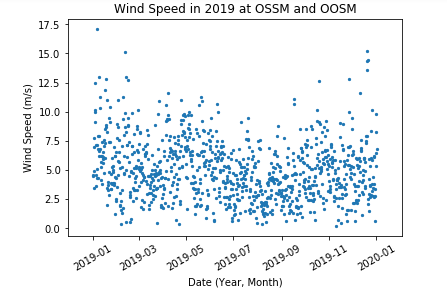
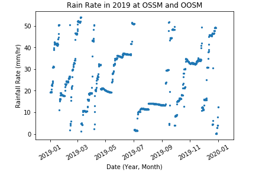
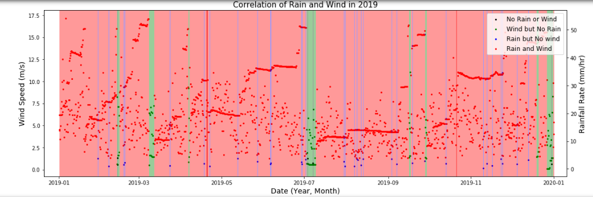
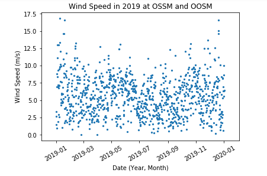
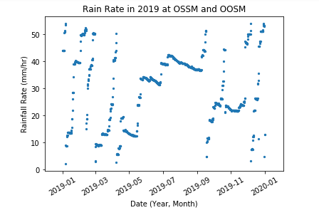
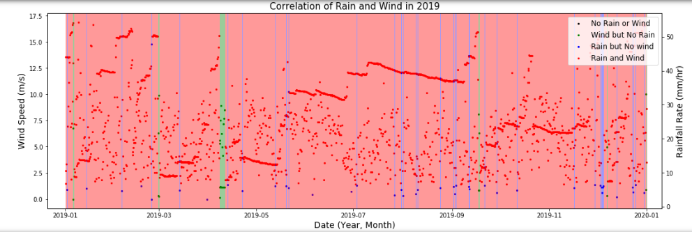
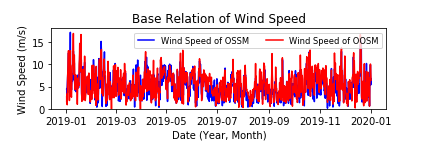
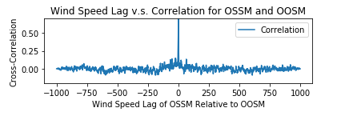
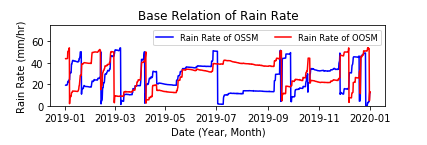
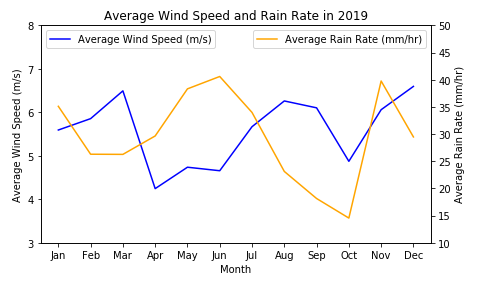

# BME-450-Project-2

Code Link: https://github.com/SamEF99/BME-450-Project-2/blob/master/BME%20450%20Project%20%232.ipynb

# Problem Statement:

For this project, we need to analyze data over the course of a year for two sites: Oregon Shelf Surface Mooring and Oregon Offshore Surface Mooring. We need to take data on wind speed and precipitation and analyze it in several ways. First we need to simply plot them over the year to see overall trends. Next, we need to plot what times of year were a) not rainy or windy, b) windy, but not rainy, c) rainy, but not windy, and d) both windy and rainy. We will plot these using colored bars to show what length of time each state was. We then need to graph the correlation between the two sites for both wind speed and precipitation, and calculate the time lag and maximum correlation. Finally, we need to plot the monthly averages of wind speed and precipitation to gather information on how the average changes over the seasons.

# The Code:

The code pulls data from the OOI website using the same methods as in Project 1, but without the user input. We use a request command to take data from the URL we provide, and append the data into arrays from calling the columns. For wind speed, we use vector addition to get a resultant speed from the northward and eastward data. From that, we can append data to specify the site we are taking data from. We also have code set to replace any NaN data with zeroes, so that this can still be plotted. For each set of data, we then plot the wind speed and precipitation against time. Next, we compare the data against the mean for the four possible conditions, and plot each in a different color. The code here also plots vertical bars at each point to show the full time span. We also adjust the graph size to make the bars larger and easier to read.

For the next part we find the cross correlation for the wind speed and precipitation between the two sites. The code checks the lag between points and graphs the lag against cross correlation. It also returns values for the max correlation, lag, and the lag point at which the max correlation occurs. Finally, we have a function that sorts the data by month and appends their mean to an array of averages. The code plots these averages over time, using two y-axes to represent both datasets.

# Results:

Max Correlation is at Lag 0

Lag in Days: 0

Max Correlation is 0.739

Max Correlation is at Lag 340

Lag in Days: 123

Max Correlation is 0.3465862996383567

# Questions:

a.) There does not appear to be a relationship between the time lag of the wind and precipitation lag. The wind speed lag is calculated as zero, and the lag for precipitation is 123. Even looking at the graphs, the lag for the wind speed appears to be much smaller than the lag of the precipitation. It is possible that the wind speed data is so random that no conclusion about lag can be drawn from it.

b.) From the graphs of the monthly averages, we can see that wind speed and rain rate had almost an inverse correlation. At the highest points of wind speed, precipitation is at its lowest, and vice versa. The curves are also vaguely sinusoidal, alternating between peaks and valleys over the year. An additional observation is that the begenning and end of the data do not line up, suggesting different conditions between the winters of 2019 and 2020.

c.) The highest rain rate occurred during June and November. The lowest rain rate occurred during October. I don't know the exact reason for this, it is odd that the lowest point for rain occurred just before one of the peaks. I also don't know if the device considers snow as precipitation, if not it could explain the low points in the winter and spring data. It does make sense that in late spring and early summer, rain rate would increase.

d.) The highest wind speed occurred during March, August, and December. The lowest wind speed occurred during April and October. If wind is mainly determined by temperature gradients in the atmosphere, I would think that times of extremes would cause the wind speed to increase, mainly summer and winter, which matches some of the peaks in the data. The lows are also during spring and autumn, which are relatively moderate compared to other seasons. 

# Conclusion:

In summary, we found data for the wind speed and precipitation for two sites in Oregon. We plotted those values, and compared the correlation between when it was windy and rainy and how those conditions did and did not line up. We found the cross correlation for each measurement between different sites, and found the maximum correlation and time lag. Finally, we found and plotted the monthly averages. From this data we can infer observations about relationships between lag and correlation, the change in data over days and months, and the local peaks and lows of the wind speed and precipitation. 

# References:

https://ooinet.oceanobservatories.org/data_access/?search=CE02SHSM-SBD11-06-METBKA000#CE02SHSM-SBD11-06-METBKA000

https://ooinet.oceanobservatories.org/data_access/?search=CE04OSSM-SBD11-06-METBKA000#CE04OSSM-SBD11-06-METBKA000

https://currents.soest.hawaii.edu/ocn_data_analysis/_static/SEM_EDOF.html
