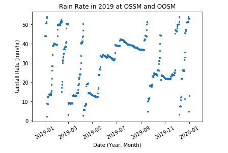
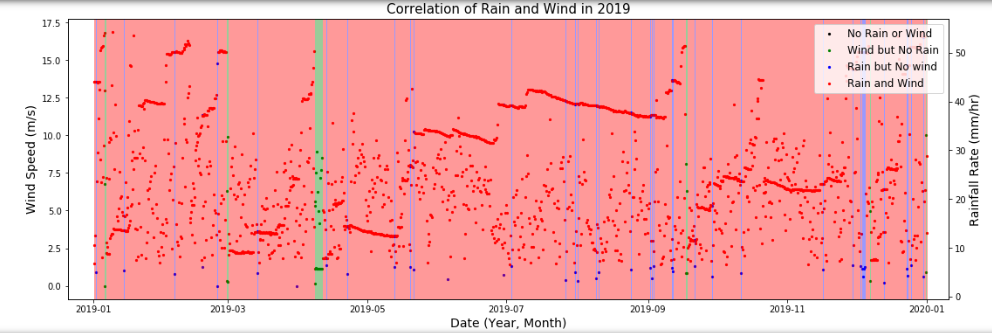
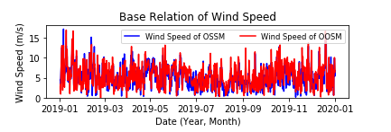
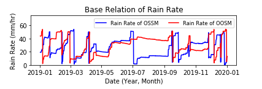
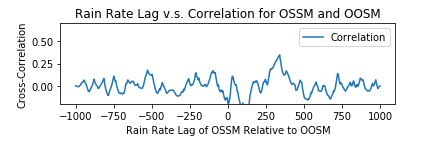
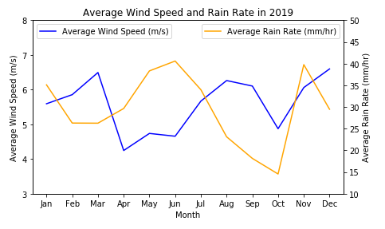

# BME-450-Project-2

Code Link: 

# Problem Statement:

# Results:

Max Correlation is at Lag 0

Lag in Days: 0

Max Correlation is 0.739

Max Correlation is at Lag 340

Lag in Days: 123

Max Correlation is 0.3465862996383567

